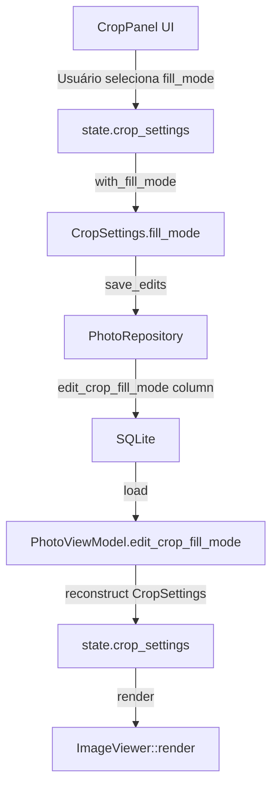

# Rotation Fill Mode - Investigação e Implementação

Este documento descreve como funciona o preenchimento de áreas vazias quando uma imagem é rotacionada no modo Crop & Straighten.

## Arquitetura Atual

### Fluxo de Dados do Fill Mode



### Componentes Envolvidos

| Componente | Arquivo | Responsabilidade |
|------------|---------|------------------|
| `CropSettings` | `crates/domain/src/value_objects/crop_settings.rs` | Value object que contém `fill_mode` |
| `RotationFillMode` | `crates/domain/src/value_objects/rotation_fill_mode.rs` | Enum com opções: Black, White, Transparent, Intelligent, ShrinkToFit |
| `CropPanel` | `crates/ui/src/components/crop_panel.rs` | UI para seleção do fill mode |
| `ImageViewer` | `crates/ui/src/components/image_viewer.rs` | Renderização da imagem com fill |
| `Photo` | `crates/domain/src/entities/photo.rs` | Entidade com campo `edit_crop_fill_mode` |
| `PhotoRepository` | `crates/infrastructure/src/database/photo_repository.rs` | Persistência do `edit_crop_fill_mode` |

---

## Renderização da Imagem Rotacionada

### Dois Modos de Renderização

O `ImageViewer::render` tem dois caminhos distintos controlados por `apply_crop_clip`:

#### 1. Modo Edição (`apply_crop_clip = false`)

Quando o usuário está editando o crop (crop mode ativo):

```rust
// Edit Mode: Full image is shown, rotated
let total_degrees = (crop.rotation_90() as f32 * 90.0) + crop.angle();
if total_degrees != 0.0 {
    // Draw fill background FIRST
    if crop.angle() != 0.0 {
        let fill_color = match crop.fill_mode() { ... };
        ui.painter().rect_filled(img_rect, 0.0, fill_color);
    }
    // Then draw rotated image ON TOP
    img = img.rotate(total_degrees.to_radians(), Vec2::splat(0.5));
}
```

**Resultado**: Fundo preenchido com a cor selecionada, imagem rotacionada por cima. ✅ Funciona corretamente.

#### 2. Modo Aplicado (`apply_crop_clip = true`)

Quando o crop foi aplicado (mostrando resultado final):

```rust
// Applied Mode: Only crop area is shown using custom mesh
// 1. Calculate UV coordinates for 4 corners of crop rect
// 2. Apply inverse rotation to find source texture coordinates
// 3. Draw fill background
// 4. Draw mesh with calculated UVs
```

**Problema**: O mesh cobre toda a `img_rect` e usa UVs calculados. Quando a rotação faz os UVs irem além de [0,1], a GPU usa "edge clamping" - esticando os pixels da borda da imagem.

---

## O Problema do Edge Clamping

### Visualização

```
          Crop Rect (img_rect)
    ┌─────────────────────────────┐
    │ ╱ ╲                     ╱ ╲ │  <- Cantos com UVs fora de [0,1]
    │╱   ╲                   ╱   ╲│     GPU estica pixels da borda
    │     ╲─────────────────╱     │
    │      │ Imagem Real   │      │
    │      │ (UVs válidos) │      │
    │     ╱─────────────────╲     │
    │╲   ╱                   ╲   ╱│
    │ ╲ ╱                     ╲ ╱ │
    └─────────────────────────────┘
```

### Por que acontece

1. O mesh é um quad simples com 4 vértices
2. Cada vértice tem uma coordenada UV
3. Quando a imagem é rotacionada, as UVs dos cantos do crop podem sair do range [0,1]
4. A GPU usa `GL_CLAMP_TO_EDGE` por padrão, repetindo os pixels da borda

### Código Atual (Problemático)

```rust
// image_viewer.rs lines ~280-305
let screen_corners = [img_rect.min, ...];
for (i, &pos) in screen_corners.iter().enumerate() {
    mesh.vertices.push(Vertex {
        pos,
        uv: uvs[i],  // UV pode ser < 0 ou > 1
        color: Color32::WHITE  // Sempre branco = mostra textura clamped
    });
}
```

---

## Soluções Possíveis

### Solução 1: Vertex Color por UV Bounds (Implementada - Parcial)

Verificar se cada UV está dentro de [0,1] e ajustar a cor do vértice:

```rust
let uv_in_bounds = uv.x >= 0.0 && uv.x <= 1.0 && uv.y >= 0.0 && uv.y <= 1.0;
let vertex_color = if uv_in_bounds {
    Color32::WHITE
} else {
    fill_color
};
```

**Limitação**: A GPU interpola cores entre vértices, criando gradientes suaves em vez de bordas nítidas.

### Solução 2: Mesh Complexo (Melhor)

Subdividir o mesh em múltiplos triângulos e só desenhar os que têm UVs válidos:

1. Calcular o polígono de interseção entre:
   - O quad do crop rotacionado
   - O quad [0,1]×[0,1] da textura
2. Triangular esse polígono
3. Desenhar apenas essa área

**Complexidade**: Requer algoritmo de interseção de polígonos (Sutherland-Hodgman).

### Solução 3: Clip Rect (Mais Simples)

1. Calcular em screen space onde a imagem rotacionada realmente existe
2. Usar `ui.set_clip_rect()` para recortar a área de desenho
3. Desenhar fill + mesh

**Limitação**: Pode não funcionar bem com mesh customizado.

### Solução 4: Shader Customizado (Ideal, mas complexo)

Criar um shader WGSL que:
- Recebe `fill_color` como uniform
- No fragment shader, verifica se UV está em [0,1]
- Se fora, retorna `fill_color` em vez de samplear textura

---

## Estado Atual da Persistência

### Campos no Banco

```sql
-- migrations/016_add_crop_fill_mode.sql
ALTER TABLE photos ADD COLUMN edit_crop_fill_mode INTEGER DEFAULT 0;
```

### Mapeamento Enum → Integer

| Valor | Enum |
|-------|------|
| 0 | Black (default) |
| 1 | White |
| 2 | Transparent |
| 3 | Intelligent |
| 4 | ShrinkToFit |

### Fluxo de Save

1. `CropPanel` atualiza `state.crop_settings.fill_mode`
2. "Apply" define `pending_crop_apply = true`
3. `App::update` detecta e marca para auto-save
4. `EditorController::save_edits` é chamado com `crop_fill_mode`
5. `SavePhotoEditsUseCase` chama `photo.set_edits` com fill_mode
6. `PhotoRepository::update` persiste no SQLite

### Fluxo de Load

1. `PhotoRepository::row_to_photo` lê `edit_crop_fill_mode`
2. `Photo::reconstruct` recebe o valor
3. `LibraryController::get_all_photos` popula `PhotoViewModel.edit_crop_fill_mode`
4. `App` reconstrói `CropSettings` usando `with_fill_mode_value`

---

## Debug Logs Adicionados

```rust
// image_viewer.rs
eprintln!("ImageViewer: apply_crop_clip=true, angle={}, fill_mode={:?}", crop.angle(), crop.fill_mode());

// crop_panel.rs
eprintln!("CropPanel: User selected fill_mode={:?}", mode);
eprintln!("CropPanel: Updated crop_settings.fill_mode={:?}", crop_settings.fill_mode());
```

---

## Próximos Passos

1. [ ] Implementar Solução 2 (Mesh Complexo) ou Solução 4 (Shader)
2. [ ] Remover debug logs após correção
3. [ ] Testar todos os fill modes
4. [ ] Atualizar walkthrough com a solução final
