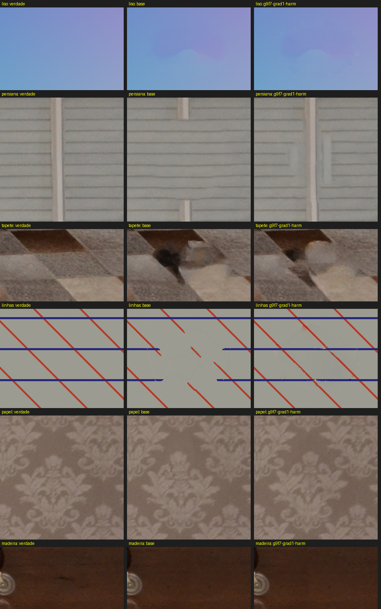
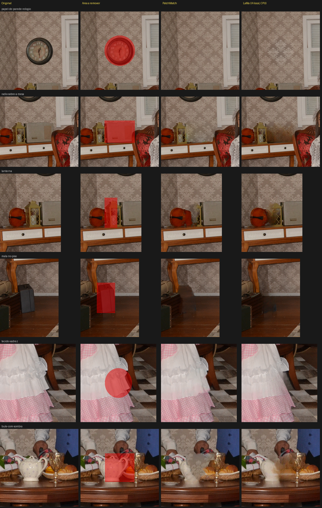

# 17 — Preenchimento sensível ao conteúdo: PatchMatch melhorado e IA local (LaMa)

> Pedidos do dono (06–07/out/2026): o Content-Aware Fill do Photoshop no editor — selecionar, ajustar a
> região de amostragem, ver a prévia, confirmar numa camada separada —, depois a escolha entre o preenchimento
> tradicional e um modelo de IA executado no próprio computador, e um módulo de IA organizado para outras
> tarefas.

## Diagnóstico do que havia (0.1.105)

| O que havia | Lacuna ou defeito |
|---|---|
| `revelacao-core::preenchimento`: PatchMatch + EM em pirâmide + síntese coerente | As fontes já exigiam o **suporte inteiro** do patch fora do buraco (certo). Não havia região de amostragem, cancelamento nem progresso |
| ⇧⌫ e o pincel de correção (J) | 🐛 **Remendo sobre versão velha**: colava pelo índice da camada de quando começou, sem conferir se o documento mudou durante o cálculo. 🐛 **Borda suave perdida**: o buraco era só onde a seleção passa de 50%, a rampa de uma seleção difundida ficava fora da caixa do remendo |
| — | Sem prévia, sem confirmação, sem camada de retoque, sem escolha de método |

Os dois defeitos foram corrigidos no caminho rápido (que continua existindo): a versão do documento é conferida
antes de colar (`Sessao::mudou_desde`), e toda a borda suave é refeita e misturada pelo peso.

## A arquitetura

```text
editor-core (sem GPUI, sem motor)   ← o documento, a camada, o passo do desfazer
     ▲
ui-gpui ── editor/preenchimento.rs (sem janela: região, reduzir, sobreposição, prévia)
        └─ editor/janela/painel_do_preenchimento.rs (o painel, o cálculo, os modelos)
     │
     ▼
preenchimento (os motores)  ── contrato Motor: PatchMatch e LaMa
     │                    │
revelacao-core            ia-local (comum a toda IA do app)
(PatchMatch, wasm)        ├─ modelos: catálogo, download, hash, importação, remoção
                          └─ execucao: backend, sessão reaproveitada, inferência cancelável
```

- **`crates/ia-local`** não sabe para que a IA serve: uma tarefa nova (remover fundo, ampliar, ajuste
  automático) declara o seu `Modelo` e usa `execucao::sessao`. O ONNX Runtime entra **estático** no executável
  (`ort` 2.0.0-rc.13, baixado na compilação; conferido com `otool -L`: nenhuma biblioteca dinâmica ao lado — o
  instalador dos balcões troca só o executável).
- **`crates/preenchimento`**: o contrato (`Motor`, `Capacidades`, `Entrada`, `Saida`, `Progresso`, `Controle`,
  `Erro`) e os dois adaptadores. Fica fora do `editor-core` e fora do `revelacao-core` (que compila para wasm).
- **Três máscaras que não se confundem**: o **destino** (o que se reconstrói) e a **amostragem** (de onde as
  fontes vêm) entram no motor; o **peso de aplicação** (a borda suavizada) é usado só ao colar. Nenhuma é a
  máscara de camada — e o painel não abre com o pincel na máscara de camada.

## O fluxo no editor

1. Selecione o objeto (qualquer ferramenta de seleção) e clique em **Preenchimento sensível ao conteúdo…** (na
   seção Seleção). Também abre sem seleção: o pincel **+ Remover** marca a área.
2. Escolha o **método**: *Conteúdo tradicional (PatchMatch)* ou *IA local (LaMa)*.
3. O palco mostra a área a refazer (vermelho) e, para o PatchMatch, **de onde os pedaços podem vir (verde)** —
   automática em volta, ajustável com **+ Amostra / − Amostra** (⌥ inverte) e **Amostragem automática**. A LaMa
   não tem região de amostragem: o painel diz isso e mostra a **moldura tracejada do contexto** que ela vê, com
   a **margem de contexto** ajustável.
4. **Suavização da borda** (px): o peso é a seleção difundida e o destino cobre a rampa.
5. **Visualizar** (ou Enter): só então calcula. PatchMatch: primeiro uma **prévia provisória reduzida** (o
   destino com até 160 px), depois o **resultado final** na resolução da foto. O resultado aparece na janela da
   **Visualização** (o recorte em volta da área), com **Antes / Depois** para comparar. Qualquer ajuste depois
   disso (pincel, suavização, método, backend, margem) tira a visualização e trava o Aplicar até visualizar de
   novo; durante o cálculo o botão vira **Parar**.
6. **Aplicar** (Enter) só com o resultado final visualizado: uma **camada "Preenchimento N"** acima da
   escolhida — criar a camada e pintar o remendo são **um** passo do desfazer; só os tiles tocados existem.
   **Cancelar** (Esc) deixa tudo como estava.

**Espaço modal, como no Photoshop** (dono, 07/out/2026: *"logo de cara o efeito já aplicado. Precisa ter um
botão de visualizar"* e *"deveria abrir um modal separado, como Photoshop faz"*, na 0.1.108). Abrir não calcula
mais: até a 0.1.107 o painel calculava ao abrir e a cada ajuste. O preenchimento toma a janela do editor: a
barra dele no lugar da do editor (sem Salvar, zoom nem desfazer), a foto com o pincel à esquerda (só a
sobreposição — vermelho e verde), a Visualização no meio, os ajustes à direita. Enquanto aberto, nenhum comando
mexe no documento (`na_sessao`, `usar`, `usar_auxiliar` e ⌘S recusam): o que se aplica é o que foi visto.
As escolhas (método, backend, margem, suavização, camada nova) ficam em `preenchimento.json` no catálogo,
gravadas a cada mudança (`Lembrado`), e voltam na próxima abertura.

**O painel** (pedido do dono, 07/out/2026: *"essa dock tá muito desorganizada, utilize os componentes do GPUI
KIT … com o tamanho ajustável"*): cabeçalho com o ícone e uma linha de explicação; seções `GroupBox` do kit
(Método, Modelo de IA, Pincel, Ajustes, Resultado); o estado do modelo num `Tag` (Instalado, Não instalado,
Baixando, Incompleto); Incluir/Excluir num `ButtonGroup` por alvo (as bolinhas verde e vermelha são as cores do
palco); `Switch` para "Ver o original" e "Aplicar numa camada nova"; o cálculo com `Spinner` e `Progress`, o
resultado num `Alert` (sucesso, informação ou erro); Cancelar, Visualizar e Aplicar fixos no rodapé. **O painel da direita
do editor tem a largura ajustável** pelo `h_resizable` do kit — de 240 a 560
pontos, 320 por padrão — gravada em `docas-editor.json`, como as colunas do caixa.

Responsividade: o cálculo roda fora da thread da tela; cada pedido tem um número e a resposta de um pedido antigo
é descartada; só o Visualizar dispara um cálculo; o pedido anterior é **cancelado de verdade**
(PatchMatch entre etapas e cascas; LaMa pelo `RunOptions::terminate` do ONNX Runtime); a versão do documento é
conferida antes de aplicar; fechar a janela derruba o cálculo e solta a sessão da IA.

## O PatchMatch melhorado — medido na bancada

`crates/revelacao-core/examples/bancada_do_preenchimento.rs`: cenas com **a verdade conhecida** (recortes da foto
do balcão e cenas sintéticas, com um buraco elíptico de 1/3 da cena) e cada variante medida — RMSE da luminância
no buraco, nitidez (energia do gradiente ÷ a da verdade; < 1 é borrado) e **costura** (o salto na borda ÷ o da
verdade; > 1 é emenda visível).

| Cena | Antes (RMSE / nitidez / costura) | Recomendada |
|---|---|---|
| Papel de parede | 8,1 / 0,97 / 1,71 | 8,5 / 0,97 / **0,94** |
| Madeira | 3,8 / 0,76 / 1,72 | 3,9 / 0,75 / **0,95** |
| Tapete xadrez | 36,7 / 1,13 / 2,39 | **28,1** / 1,11 / **1,10** |
| Persiana (linhas retas) | 9,4 / 0,86 / 1,67 | **6,6** / 0,86 / **0,95** |
| Degradê liso | 2,8 / 1,01 / 2,09 | 2,6 / 1,04 / **0,92** |
| Linhas atravessando | 26,2 / 0,68 / 1,13 | **7,2** / **1,01** / 0,99 |

A recomendada (`Qualidade::recomendada`) é a soma de três peças, cada uma medida sozinha:

- **patch 9×9 nos níveis grossos** (onde se decide a estrutura) e 7×7 no cheio (a textura);
- **o gradiente na distância** entre patches (peso 1);
- **a membrana** (Pérez et al., 2003, por push-pull): o desvio de tom na borda espalhado pelo buraco — a
  costura cai para o nível da verdade, a custo zero.

Medido e **descartado**: o Poisson guiado completo (borrava a textura: nitidez da madeira 0,75 → 0,59), só a sua
baixa frequência (manchas coloridas nas linhas), e a versão adaptativa (madeira e papel de baixo contraste
contam como lisos e borram). Custo da recomendada: ~50% a mais de tempo.

🔑 **A Revelação continua com o remendo de antes, bit a bit** (`Qualidade::default`): o teste
`o_caminho_sem_amostragem_explicita_e_o_de_antes` prende os digests de 12 casos conferidos lado a lado com a
versão anterior — o mesmo remendo no desktop e no site.



## A IA local — LaMa

**O modelo** (verificado em 06/out/2026): `lama_fp32.onnx` de huggingface.co/Carve/LaMa-ONNX (commit
`c3c0c9e4`), 208 044 816 bytes, SHA-256 `1faef5301d78db7dda502fe59966957ec4b79dd64e16f03ed96913c7a4eb68d6`.
**Apache-2.0** nos pesos (o cartão do modelo), no port exportável (github.com/Carve-Photos/lama) e no original
(github.com/advimman/lama). Não vai no repositório nem no executável: o operador baixa.

**Entradas e saídas**, conferidas rodando: `image` `[1,3,512,512]` e `mask` `[1,1,512,512]` em `f32` (imagem em
0..1, máscara 1 onde reconstruir); saída `[1,3,512,512]` já em 0..255. 🚨 **Os canais são BGR**: com RGB (como faz
a demonstração do autor) o miolo sai azulado — achado no primeiro teste real.

**A resolução**: a entrada é fixa em 512. O recorte em volta do destino (com a margem de contexto) entra **na
resolução da foto quando cabe**, completado por espelho como no pré-processamento original; acima disso é
reduzido (média de área) e o resultado ampliado — o painel diz "a IA trabalha em 512 px: esta área foi reduzida
1:N", e isso **não** é reconstrução nativa em alta resolução. Fora do destino, os pixels são os da foto.

**Os backends** (o modelo não é o backend) — medidos num Mac com Apple Silicon:

| Backend | Por inferência | Memória | Situação |
|---|---|---|---|
| CPU | 2,0 s (4,5 s na 1ª, com a carga) | 1,1 GB | **o automático** |
| CoreML | 12 a 42 s (28,7 s no app) | 2,1 GB | disponível, marcado "mais lento com este modelo"; as FFTs voltam à CPU |
| DirectML | — | — | compilado no Windows; **não testado** (sem Windows aqui) |
| CUDA | — | — | feature `cuda` (não compilada por padrão: sem NVIDIA para testar, e o runtime com CUDA pesa centenas de MB a mais na compilação de cada balcão) |

O backend que falha ao registrar volta à CPU **e o painel diz** ("… não pôde ser usado (motivo) — rodando na
CPU"). A sessão é carregada uma vez e reaproveitada (uma só em cache: ~1 GB); fechar a janela a solta.

**Os modelos** (`ia-local::modelos`): download explícito com o tamanho, progresso, cancelamento e o SHA-256
conferido antes de instalar (num `.parte` renomeado no fim — download interrompido nunca parece instalado);
importação de arquivo local (o hash publicado instala como verificado; outro só entra com a assinatura
`image`/`mask`/saída 512, marcado como não verificado); remoção; a pasta de dados do app
(`…/VintageLightbox/modelos`, ou `VLB_MODELOS`). "Modelo não instalado", "backend indisponível" e "erro de
processamento" são erros diferentes, com mensagens diferentes.

🔒 **Offline**: com a rede negada pelo kernel (`sandbox-exec` com `deny network`; o `curl` nem conecta), a LaMa
calculou no editor em 4,5 s. A única conexão do módulo é o download pedido pelo operador.

## PatchMatch × LaMa na foto de estúdio

`crates/preenchimento/examples/comparar_metodos.rs` (os mesmos motores do editor):



| Caso | PatchMatch | LaMa (CPU) | Melhor |
|---|---|---|---|
| Relógio no papel de parede | 3,0 s, nítido | 4,5 s (reduzida 1:2), um pouco mais suave | os dois bons |
| Rádio sobre a mesa | 2,4 s, papel com um fantasma leve | 2,1 s, mancha marrom | PatchMatch |
| Lanterna entre objetos | 1,1 s, traz um pedaço do violino | 2,1 s, borrão amarelado | nenhum |
| Mala no piso de madeira | 2,6 s, mancha escura | 2,0 s, piso, rodapé e parede continuam | LaMa |
| Tecido do vestido | 1,0 s, guarda o babado | 2,0 s, mais suave | os dois bons |
| Bule com sombra | 0,9 s, ruidoso | 2,1 s, borrado | nenhum |

Não há vencedor geral — por isso os dois ficam no seletor. A LaMa ganha onde é preciso continuar estrutura
grande (piso, rodapé); o PatchMatch, onde a textura fina importa e a região de amostragem ajuda.

## Conferência

- `revelacao-core`: os testes do preenchimento (11 + o dos digests): fontes proibidas nunca entram (nem pela
  borda do patch), sem fontes e sem destino com erro claro, cancelamento, progresso por etapa até 1, buracos de
  1 px, grandes, desconectados e encostados na borda (fora do destino, a própria foto).
- `ia-local`: download por um servidor HTTP local (progresso, hash, instalação, arquivo cortado acusado,
  remoção), hash errado e cancelado não instalam nada, sem rede é erro de rede, importação por hash ou por
  assinatura; com o modelo real (`--ignored`): backend indisponível volta à CPU com aviso, sessão reaproveitada.
- `preenchimento`: o recorte de contexto (quina, borda), a ida e volta na resolução nativa devolvendo a foto
  exata e com o BGR conferido, a redução acima de 512 com as coordenadas certas, sem modelo = "modelo ausente";
  com o modelo real (`--ignored`): o quadrado sai e o cancelamento para.
- `editor-core`: a camada de retoque num passo (desfazer/refazer), só os tiles tocados, fora do remendo a foto
  exata, a borda suave mistura, documento mudado recusa; o pincel da amostragem.
- `ui-gpui`: os testes do módulo sem janela (região por método, prévia reduzida, sobreposição, suavização) e
  `o_preenchimento_sensivel_ao_conteudo_pela_tela` (prévia sem mexer no documento, Esc sem rastro, resultado de
  pedido antigo descartado, Enter numa camada nova num passo, ⌘Z, documento mudado recusa, não abre na máscara).
- **No editor real** (4608×3072, macOS): o relógio removido pelo PatchMatch (3,6 s) e pela LaMa (4,5 s), aplicar
  (camada "Preenchimento 1", 9 tiles, um passo) e ⌘Z; o download do modelo pelo painel (progresso, verificado);
  a LaMa sem rede; o CoreML escolhido à mão.
- Roteiro: `preenchimento abrir | aplicar | cancelar | original | redefinir | metodo patchmatch|lama | backend
  CHAVE | contexto N | suavizar N | pincel amostra|remover [excluir] | camada-nova sim|nao | baixar | remover |
  importar CAMINHO`; o `estado` mostra o preenchimento.

## Limitações reais

- **Testado só no macOS (Apple Silicon).** Linux compila o `ort` com binários baixados na compilação.
- **Windows (MSYS2, `-gnu`) carrega o runtime em tempo de execução** (0.1.121). O `ort` não tem binário pronto
  para `x86_64-pc-windows-gnu`, e da 0.1.106 à 0.1.120 o balcão Windows não compilou (`ort-sys: no prebuilt
  binaries`). Lá ele usa `load-dynamic`: o `onnxruntime.dll` oficial (1.28.0, só CPU) é baixado com o modelo
  ou na primeira inferência, conferido pelo hash e carregado pelo caminho completo (`ia-local/src/runtime.rs`).
  O DLL pede o Visual C++ Redistributable (x64), que o instalador põe pelo winget; sem ele só a IA avisa.
- **CUDA não compilado** por padrão (feature `cuda`); nada medido com NVIDIA.
- **LaMa em 512 px**: áreas grandes são reduzidas e ampliadas (o painel avisa); sem progresso interno (a barra é
  indeterminada).
- **Degradê liso**: o PatchMatch ainda deixa uma variação de tom dentro do buraco (a membrana tira a emenda da
  borda, não a de dentro); o Poisson que tirava borrava as texturas e foi descartado.
- **Nenhum dos dois reconstrói estrutura que não existe na foto** (rostos, objetos parcialmente encobertos);
  cenas cheias de objetos pequenos (o bule) saem fracas nos dois.
- O painel lembra o método e o backend só enquanto a janela está aberta.

## Como o Content-Aware Fill do Photoshop (08/out/2026)

Pedido do dono: *"faça parecido com o Photoshop, mas preserve o que fizemos com IA local"*. O espaço modal ganhou
a organização de lá; o método (PatchMatch ou IA local), o modelo, a margem de contexto e o processamento ficam.

- **Barra de ferramentas do espaço** (à esquerda): pincel de amostragem (B), pincel da área (o nosso, para marcar
  sem seleção), laço (L) para a área a refazer, mão (H) e lupa (Z) — as letras valem dentro do espaço. Com a IA o
  pincel de amostragem fica apagado. Sem seleção, abre com o laço.
- **Barra de opções** em cima: Adicionar/Subtrair (⌥ inverte) e o tamanho nos pincéis; o modo no laço; 100%,
  Encaixar e Preencher na mão e na lupa.
- **Painel**, nas seções do Photoshop: Método (+ Modelo de IA); **Sobreposição da área de amostragem** (mostrar,
  opacidade, cor, indica a área de amostragem ou a excluída — só o PatchMatch); **Opções da área de amostragem**
  (Automática, Retangular, Personalizada — esta começa vazia com o pincel de amostragem na mão — e **Amostrar
  todas as camadas**, que troca o instantâneo pela composição inteira); **Configurações de preenchimento**
  (**Adaptação de cor** Nenhuma/Padrão, que liga a membrana do PatchMatch — `Entrada::adaptar_cor`,
  `Capacidades::adaptacao_de_cor`; a IA não tem —, suavização da borda, margem de contexto e processamento da
  IA); **Configurações de saída** (**Saída para**: camada atual, nova camada ou **duplicar camada** —
  `SaidaDoPreenchimento::Duplicada`, a cópia da escolhida com o remendo num passo).
- **Rodapé**: ↺ Redefinir (os ajustes voltam ao padrão; método e área ficam), Visualizar/Parar, Cancelar,
  **Aplicar** (grava e o espaço reabre para a próxima área, com os mesmos ajustes) e **OK** (grava e fecha; Enter).
- Tudo isso volta na próxima abertura (`preenchimento.json`; o arquivo antigo, sem `saida`, vale pelo
  `camada_nova`).
- Rotação, escala e espelhamento do Photoshop não entraram: o PatchMatch não busca patches transformados.
- **⇧⌫ abre o "Preencher"** do Photoshop (Conteúdo: sensível ao conteúdo — o remendo direto de sempre —, cor de
  frente, cor de fundo, preto, 50% cinza, branco); também em Editar › Preencher… e no botão direito com seleção.
  ⌥⌫ continua preenchendo com a cor de frente.

